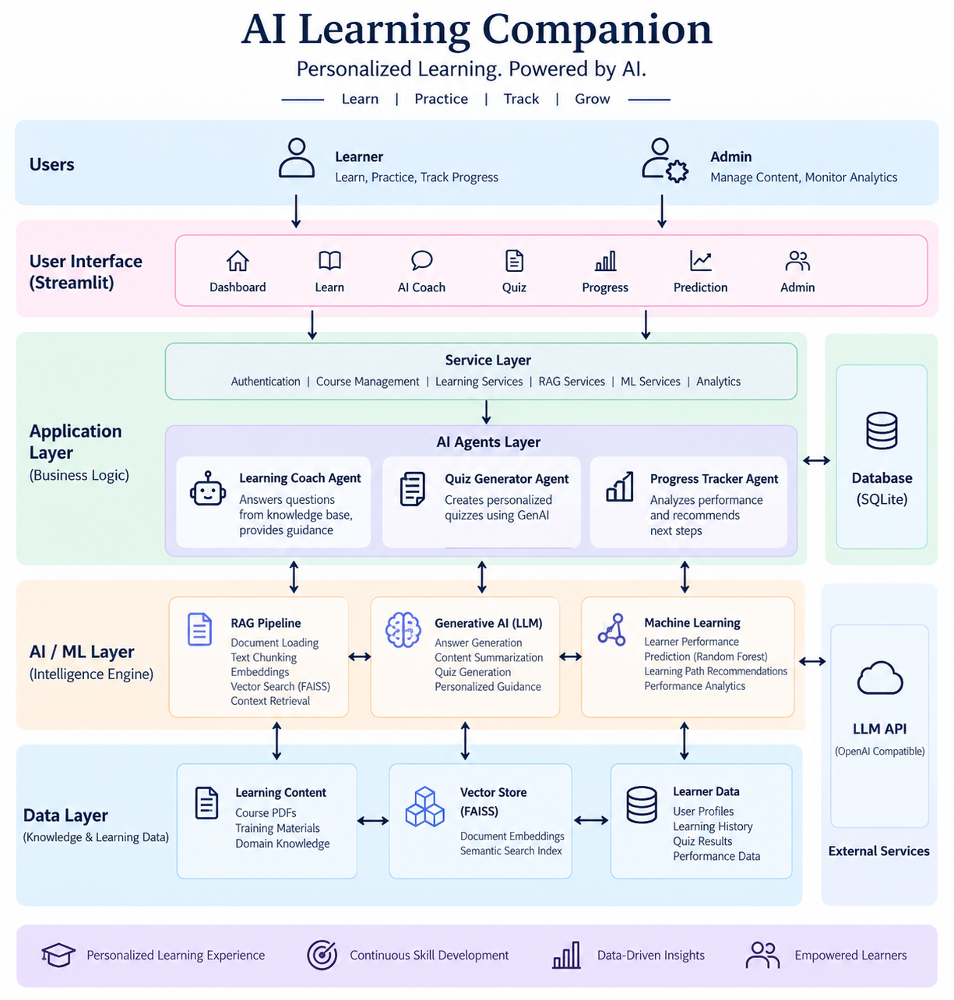

# 🤖 AI Learning Companion

> 🎓 **Personalized Learning. Powered by AI.**

AI Learning Companion is an AI-powered personalized learning platform that combines **Machine Learning, Retrieval-Augmented Generation (RAG), Generative AI, and intelligent learning services** to help learners study technical subjects, practice through AI-generated quizzes, receive contextual guidance, and track their learning progress.

The platform provides a learner-focused experience together with administrative capabilities for managing courses, learning materials, topics, and analytics.

---

## 📌 Overview

Traditional learning platforms mainly provide static course material and basic progress tracking. AI Learning Companion extends this experience by combining learner performance data with document-based knowledge retrieval and Generative AI.

The platform can:

- 🎯 Personalize learning based on learner performance
- 📚 Retrieve relevant information from course documents
- 🤖 Provide contextual answers through an AI learning coach
- 📝 Generate quizzes dynamically
- 📄 Generate learning summaries
- 📊 Predict learner performance using Machine Learning
- 📈 Track learning progress and activity
- 👨‍💼 Provide administrators with course, material, topic, and analytics management

The goal is to bring **content, practice, feedback, and progress tracking together in one learning platform**.

---

## ✨ Key Features

### 👨‍🎓 Learner Features

- 🔐 User authentication and profile management
- 🏠 Personalized learner dashboard
- 📚 Course and topic-based learning
- 🤖 AI-powered learning coach
- 🔍 Context-aware question answering
- 📝 AI-generated quizzes
- 📄 Learning summaries
- 📊 Learner performance prediction
- 📈 Progress tracking
- 🔥 Learning streak tracking
- 📊 Quiz performance analysis
- 📑 PDF report generation

### 👨‍💼 Administrative Features

- 🔐 Admin authentication
- 📚 Course management
- 📂 Learning material management
- 🏷️ Topic management
- 🧠 Knowledge-base management
- 📊 Learner analytics
- 📈 Performance monitoring
- 🖥️ Administrative dashboard

---

## 🏗️ Architecture

The platform follows a layered architecture in which the user interface communicates with application services, which coordinate AI capabilities, machine-learning models, data stores, and external LLM services.



---

## 🧠 AI and Machine Learning Components

### 🔍 1. Retrieval-Augmented Generation (RAG)

The RAG pipeline allows the application to answer learner questions using the project's learning materials as a knowledge source.

```text
Course Documents
      ↓
Document Loading
      ↓
Text Chunking
      ↓
Embeddings
      ↓
FAISS Vector Store
      ↓
Similarity Search
      ↓
Relevant Context
      ↓
LLM
      ↓
Context-Aware Response
```

The approach grounds AI responses in the available learning content before generating an answer.

### ✨ 2. Generative AI

Generative AI is used for:

- 💬 Contextual question answering
- 📝 Quiz generation
- 📄 Learning summaries
- 🎯 Personalized guidance
- 🤖 AI coaching

The application uses an OpenAI-compatible LLM interface configured through environment variables.

### 📊 3. Machine Learning

The project includes a Machine Learning pipeline for learner performance analysis and prediction.

```text
Learner Data
     ↓
Preprocessing
     ↓
Feature Preparation
     ↓
Model Training
     ↓
Random Forest Model
     ↓
Performance Prediction
     ↓
Learning Insights
```

The repository contains the training, preprocessing, evaluation, prediction, and model-artifact components.

---

## ⚙️ Intelligent Learning Services

The application separates business logic from the user interface through dedicated services.

Important service areas include:

- 🔐 Authentication
- 📚 Course management
- 🎓 Learning management
- 🧠 Knowledge-base management
- 🔍 RAG processing
- 📝 Quiz generation
- 📄 Summary generation
- 📈 Progress tracking
- 📊 Performance prediction
- 📂 Material management
- 🏷️ Topic management
- 📊 Administrative analytics

This separation makes the application easier to maintain and extend.

---

## 🛠️ Technology Stack

| Area | Technologies |
|---|---|
| 🐍 Programming Language | Python |
| 🖥️ User Interface | Streamlit |
| 📊 Machine Learning | Scikit-learn |
| 🌲 ML Model | Random Forest |
| ✨ Generative AI | OpenAI-compatible LLM API |
| 🔍 RAG | LangChain-based components |
| 🧠 Embeddings | Sentence Transformers |
| 🔎 Vector Search | FAISS |
| 🗄️ Database | SQLite |
| 📊 Data Processing | Pandas, NumPy |
| 📈 Visualization | Plotly |
| 📄 PDF Generation | ReportLab |
| 🔐 Authentication | bcrypt |
| ⚙️ Configuration | Environment variables |

---

## ⚙️ Installation

### 1️⃣ Clone the repository

```bash
git clone https://github.com/runkuyasaswini/AI-Learning-Companion.git
cd AI-Learning-Companion
```

### 2️⃣ Create a virtual environment

#### 🪟 Windows

```powershell
python -m venv venv
venv\Scripts\activate
```

#### 🐧 Linux / macOS

```bash
python3 -m venv venv
source venv/bin/activate
```

### 3️⃣ Install dependencies

```bash
pip install -r requirements.txt
```

---

## 🔐 Environment Configuration

The project uses environment variables for configuration and API credentials.

Create a local `.env` file based on `.env.example`.

---

## ▶️ Running the Application

Activate the virtual environment and run:

```bash
streamlit run app.py
```

The application will start locally and provide the Streamlit interface in your browser.

---

## 📚 RAG Knowledge Base

The RAG component uses learning documents as its knowledge source.

```text
Learning Material
      ↓
Document Loader
      ↓
Text Chunker
      ↓
Embedding Model
      ↓
FAISS Index
      ↓
Retriever
      ↓
Relevant Context
      ↓
Generative AI
```

This allows the learning assistant to ground responses in the available learning content rather than relying only on general model knowledge.

---

## 📈 Machine Learning Workflow

The Machine Learning component processes learner-related data to support performance prediction.

```text
Learner Performance Data
          ↓
Data Preprocessing
          ↓
Feature Engineering
          ↓
Model Training
          ↓
Random Forest
          ↓
Model Evaluation
          ↓
Prediction Service
          ↓
Learner Insights
```

The trained model artifacts are used by the prediction functionality within the application.

---

## 🎯 Learning Experience

The platform connects the major parts of the learning cycle:

```text
                 📚 LEARN
                    │
                    ▼
             Knowledge Base
                    │
                    ▼
                🤖 AI Coach
                    │
                    ▼
               📝 PRACTICE
                    │
                    ▼
             AI-Generated Quiz
                    │
                    ▼
                 📈 TRACK
                    │
                    ▼
           Progress & Analytics
                    │
                    ▼
                 🚀 IMPROVE
                    │
                    ▼
        ML-Based Learning Insights
```

This creates a continuous learning loop instead of treating content, assessment, and progress as separate functions.

---

## 🚀 Future Enhancements

Potential future improvements include:

- 🎯 More advanced learner-personalization strategies
- 📊 Additional ML models for learner analytics
- 💡 Improved recommendation systems
- 💬 Conversation memory
- 📚 More learning domains
- 📈 Advanced analytics dashboards
- ☁️ Cloud deployment
- 🔐 Role-based access improvements
- 🧪 Automated evaluation of generated answers and quizzes

---

## 🌟 Project Highlights

- 🤖 Combines **Machine Learning, RAG, Generative AI, and application services** in one learning platform.
- 🔎 Uses **FAISS vector search** for semantic retrieval.
- 🧠 Uses **document-grounded generation** for contextual learning assistance.
- 📝 Generates quizzes and summaries dynamically.
- 📊 Provides learner performance prediction using a trained ML model.
- 🧩 Separates UI, service, AI, ML, and data responsibilities for maintainability.
- 👨‍🎓 Includes learner-facing functionality and 👨‍💼 administrative functionality.

---

